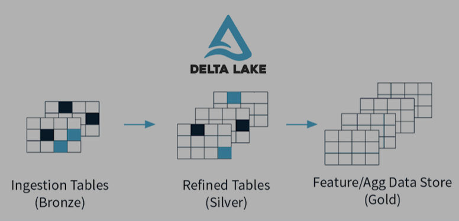

# Diseño de ingestas y lagos de datos
## Docente: Jorge Centeno
## Alumno: Facundo Goncalves Borrega

## Introducción

FarmIA  genera y recibe datos desde distintos orígenes. Estos datos pueden ser estructurados, semiestructurados o desestructurados, generándose de forma constante o en distintos momentos del día / mes / año. Por la volumetría y amplia diversidad de datos que se manejan, se implementará una arquitectura Lakehouse en Azure Databricks, donde se utilizará principalmente Pyspark.

Esta decisión otorga flexibilidad y escalabilidad para poder analizar y procesar los datos. Dentro del lakehouse, la información se ingestará por un lado de forma batch y por otra en streaming desde topics de Apache Kafka. 

Finalmente, para la ingesta batch, habrá una primera capa de landing y luego promociones en una arquitectura “Medallion” con capas de bronce, plata y oro, como también una primera copia de los datos en una capa de Raw. Por otro lado, la ingesta en streaming irá directo a la capa de bronce. 

En este documento en particular, se dará especial detalle al movimiento de datos desde Landing hasta Bronce, pero aún así habrá una propuesta de cómo serían las promociones de Bronce a Silver y Silver a Gold. Como motor de ingesta, se utilizará un programa desarrollado en Python por la empresa, ejecutado desde Databricks.

## Detalle Arquitectura


Los datos ingresan o de forma batch, a través de distintas ETLs, o por streaming a través de Apacha Kafka. La capa Landing cumple la función de ser un sitio centralizado para el ingreso de ficheros por ingesta Batch, estando también separado en un contenedor aparte de la capa Medallion y Raw, para así tener un sitio restringido y acotado donde las ETLs sepan que pueden ir escribiendo.

Luego, cuando los documentos sean promocionados por el motor de ingesta, primero habrá una capa de Raw, donde se coloca una copia del fichero de Landing, con la misma estructura de carpetas. 

Generalmente es una buena práctica tener una capa de Raw, para tener una copia del fichero así como ha llegado, sin ningún tipo de manipulación previa, que nos podrá valer para futuros reprocesamientos y también una forma de validar realmente cómo ha llegado el dato. Cuando el motor de ingesta promocione los datos, se podrá especificar si se quiere que el proceso se detenga una vez ya no encuentre más ficheros, o si se desea que el trigger sea que esté activamente buscando ficheros durante una determinada cantidad de tiempo. La frecuencia de ejecución de estos procesos, se podrá definir dentro de Jobs en Databricks, o se podrá forzar en ejecuciones manuales extraordinarias.

Dentro de la arquitectura Medallion, la información se guardará en tablas externas en el hive_metastore de Databricks, en una base de dato que será creada por cada una de las 3 capas. La escritura en las tablas será con formato delta, en modo “append” y con la posibilidad de particionar por columna del DataFrame de pyspark. Esto es en parte porque para este desarrollo no se ha contemplado Unity Catalog, pero el desarrollo eventualmente podría adoptarse para un catálogo centralizado de la empresa.



Las rutas físicas en cada capa de Medallion, comparten la misma estructura que las tablas, entonces sería: {capa_medallion}/{datasource}/{dataset}.
La idea de cada capa es que a través de reglas de negocio o necesidades de la calidad del dato, que cada sección transforme, adapte y evolucione los datos. La estructura general de las tablas externas que se escribirán en el hive_metastore, será: hive_metastore.{capa_medallion}.{ datasource}.{dataset}

## Promociones Medallion para FarmIA

Se ha eligido la estructura antes detallada, para que la misma sea customizable y además centralizada en enviar todo sólo hasta Bronze, pero dentro de la lógica específica de FarmIA, cómo es que podría aprovecharse esta estructura y cómo se podría evolucionar el código:

FarmIA tiene básicamente 5 orígenes de datos: Datos de ventas online, Registros de inventario, Sensores IoT internos y externos, Eventos de clientes en tiempo real, Datos de proveedores y logística.

Entonces, desde estos 5 orígenes, podría evolucionar así:


## Ingesta Batch

La ingesta Batch dejará ficheros en la capa de Landing, que está en su propio contenedor, separado del contenedor de Lakehouse con la capa Raw y la arquitectura Medallion. A través de esta ingesta, pueden ingresar ficheros .json, .csv, .parquet, .avro y .jpg.  Todos estos documentos deberán de entrar en una estructura de carpetas definida en común para Landing, que se construye a través del datasource de origen, su dataset y la fecha de ingesta. Entonces, la ruta dentro del contenedor de Landing, será {datasource}/{dataset}/{día}/{mes}/{año}.

Es la tarea de las distintas ETLs que traen los datos, el respetar esta estructura en Landing. Luego, al ejecutarse el motor de ingesta, el mismo recolectará los ficheros en Landing y utilizando Autoloader, los irá preparando para enviarlos a la capa Bronze, pero también dejando una copia en la capa Raw. Autoloader permitirá optimizar el rendimiento de la ingesta, como también que el esquema evolucione, definir la ruta donde se guardarán los esquemas en la capa destino, como que también se defina una ruta para los checkpoint en destino (capa bronce, en este caso). Si los ficheros a mover ya existiesen, se sobrescribirían.

En esta promoción a bronce, también se agregarán metadatos según el tipo de datos, siendo el tiempo y ruta original de ingesta para los ficheros en general, y agregando en las imágenes metadatos como el tamaño y peso de la imagen. Dentro del hive_metastore, se crearán las tablas ya mencionadas con formato delta.

## Ingesta Streaming

Esta sección de ingesta, al no poder utilizarse autoloader desde una extracción de topics de Kafka, utiliza la API nativa de spark para streaming. Los datos ingestados, no son datos que terminen en la capa de Landing, ya que la información que ingresa por Landing es la que es movida por la ingesta Batch. La esencia y volumetría de los flujos de streaming, hace que esta información reciba otro tipo de ingesta y trato.

Según una frecuencia definida y leyendo desde distintos topics en Apacha Kafka, se escribirá directamente en la capa de bronce. Se podrá escribir utilizando métodologías de “singleplex” con esquema avro o json, como también de “multiplex” con un particionado por topic. La escritura será también en tablas externa con formato delta, con la misma nomenclatura antes detallada para la base de datos y tabla.  En esta forma de ingesta, no se escribirán datos en Raw, a causa de la amplia volumetría de ficheros recibidos por este medio y los costos que eso conllevaría para el startup de FarmIA. Esto no quiere decir que, de necesitarse, pudiese agregarse una escritura en Raw y una definición más fina de hasta por cuánto tiempo, querría que se guarden esos ficheros en dicha capa.
## Guía de ejecución y despliegue
## Prerrequisitos

* Tener un entorno de Databricks donde se ejecutará el motor de ingesta
* Que ya estén creados los contenedores en el ADLS para Landing y Lakehouse
* En la parte de librerías del clsuter de Databricks, haber instalado el .wheel del motor de ingesta
* Para poder realizar las pruebas del motor de ingesta, adicionalmente se necesitará:
  * Fichero notebook que viene adjunto con la entrega, que deberá de cargarse en Databricks.
  * Fichero .config, configurado correctamente con environment = "databricks" y las credenciales para conectarse al cluster de Kafka, a su registry schema, y la ruta al fichero client_properties en el DBFS. Ejemplo:
```json
{ 
"EXECUTION_ENVIRONMENT": "databricks",
"CLIENT_PROPERTIES_PATH": "/dbfs/FileStore/client_properties",
"SCHEMA_REGISTRY_URL": "https://psrc-w7y3x9.eu-south-2.aws.confluent.cloud",
"SCHEMA_REGISTRY_USERNAME": "3QZSBIA33PAIZ4MB",
"SCHEMA_REGISTRY_PASSWORD": "cfltdkoWiv1Uto9swEhEbijsNkvQ7wQ1Oek4hcux4NRjEge4TycAKGBlcB4FZoVw"
}
```
* Para la ejecución de los pasos del notebook que servirán para la generación de datos para probar el Motor de Ingesta, antes se deberán de haber instalado en el cluster, las siguientes librerías:
    * confluent_kafka
    * fastavro
    * httpx
    * attrs
    * authlib
    * faker

## Dependencias
*  "pyspark==3.5.0",
*  "pandas==2.2.1",
*    "loguru==0.7.1",
*    "pillow==12.2.0"
* requires-python = ">=3.8"
* Para crear el wheel: setuptools>=77.0"

## Despliegue

Instalar el .wheel con el cluster de Databricks, antes de iniciarlo.
Tener listos los ficheros y configuraicones mencionadas en los prerequisitos.

## Ejecución

Es importante resaltar que el código del motor de ingesta está preparado para ejecutarse desde Databricks. He intentado también prepararlo para ejecuciones en local, pero luego desistí ya que Autoloader necesita si o si que se ejecute en la nube. Hay algunos "ifs" que he dejado, que me han valido para algunas ejecuciones aisladas en local que he hecho en pruebas.

Para ejecutar, se deben seguir las instrucciones en el notebook "actividad_ingesta.ipynb", modificando la ruta para que pille el fichero .config a utilizar en las primeras celdas.

El notebook está dividido primero en las pruebas para la parte Batch y luego Stremaing. Hay ciertas funciones auxiliares que forman parte del motor de ingesta, cuyo propósito es facilitar la generación de datos de prueba del mismo.

En la parte Batch, estará dividido por extensión de fichero de ingesta, primero en una parte para la creación de los datos y luego donde se demuestra la función del Motor de Ingesta.

Luego estará la parte streaming, separada también primero en la generación de datos y luego en las pruebas, separado para Singleplex con esquema json, avro y la parte con ingesta método Multiplex.

## Comentarios finales

No he podido realizar el desarrollo con Databricks-Conenct, por no contar en Databricks con el Unitiy Catalog. Lo aclaro ya que por eso no se verán "ifs" con importaciones de las librerías correspondientes.

Por eso también no se verá un fichero de tests con pytests, ya que las pruebas las he realizado todas desde Databricks, que igual entiendo no es lo ideal.